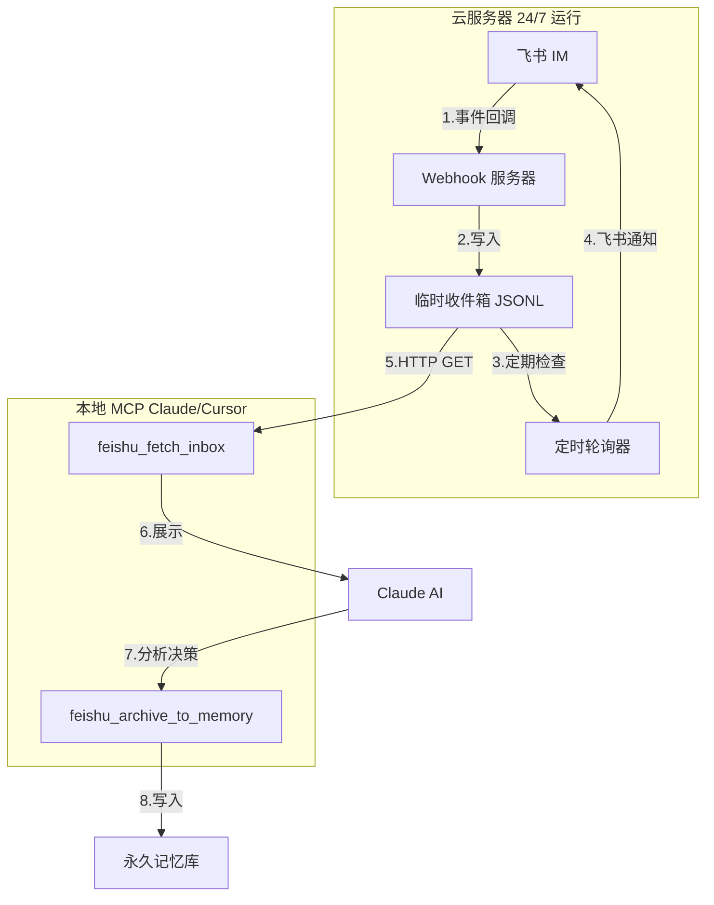

# PRD：飞书消息处理系统 v1.0

**文档版本**：v1.0  
**创建日期**：2026-01-20  
**状态**：实施中

---

## 1. 背景与动机

### 1.1 业务场景

用户希望通过飞书 IM 与 AI 助手进行双向交互，具体场景包括：

1. **输入侧**：在飞书群聊中发送消息，AI 能够接收并处理
2. **输出侧**：AI 通过飞书推送提醒、建议、复盘问题等
3. **记忆管理**：飞书消息需要经过 AI 分析后，才能转化为永久记忆

### 1.2 当前问题

**Phase 0（当前实现）存在以下问题**：

| 问题 | 描述 | 影响 |
|-----|------|------|
| 消息混入记忆系统 | 飞书回调直接调用 `add_memory`，存入 `project="feishu-inbox"` | 临时对话与永久记忆混在一起，污染记忆库 |
| 缺少 AI 分析环节 | 没有"临时区 → 分析 → 归档"的流程 | 所有消息无差别入库，无法筛选重要内容 |
| 实时推送复杂度高 | SSE 需要 TLS、长连接、本地客户端常驻 | TLS 握手失败，依赖本地电脑在线 |

---

## 2. 解决方案

### 2.1 核心架构



### 2.2 数据流说明

**接收流程**：
1. 用户在飞书群聊中 @机器人 发送消息
2. 飞书开放平台推送事件到 `https://webhook.jason2026.top/feishu/event`
3. Webhook 解析消息内容，写入临时收件箱（JSONL 文件）
4. 定时轮询器（5分钟）检查临时收件箱，如有新消息则推送飞书通知

**分析归档流程**：
5. 用户在 Claude 中调用 `feishu_fetch_inbox(limit=10)`
6. MCP 工具请求服务器 API，返回未归档消息列表
7. Claude 分析消息内容，判断是否需要归档为记忆
8. 对于需要保存的消息，调用 `feishu_archive_to_memory(...)`
9. 消息被标记为 `archived: true`，并写入永久记忆库

---

## 3. 接口定义

### 3.1 服务器 HTTP API

#### 3.1.1 POST /feishu/event（已有）

**用途**：接收飞书事件回调

**请求**：
```json
{
  "header": {
    "event_id": "xxx",
    "event_type": "im.message.receive_v1",
    "token": "verification_token"
  },
  "event": {
    "message": {
      "message_id": "om_xxx",
      "chat_id": "oc_xxx",
      "chat_type": "group",
      "content": "{\"text\":\"消息内容\"}",
      "message_type": "text",
      "create_time": "1768837235125"
    },
    "sender": {
      "sender_id": {
        "open_id": "ou_xxx",
        "union_id": "on_xxx"
      }
    }
  }
}
```

**响应**：
```json
{"ok": true}
```

---

#### 3.1.2 GET /feishu/temp_inbox（新增）

**用途**：读取临时收件箱

**请求参数**：
- `limit`（可选）：返回数量，默认 20，最大 100
- `token`（必需）：API 访问 token（环境变量 `FEISHU_WEBHOOK_READ_TOKEN`）

**响应**：
```json
{
  "ok": true,
  "count": 2,
  "items": [
    {
      "message_id": "om_xxx",
      "chat_id": "oc_xxx",
      "chat_type": "group",
      "sender_open_id": "ou_xxx",
      "created_at": "2026-01-20T10:00:00",
      "text": "消息内容",
      "archived": false
    }
  ]
}
```

---

#### 3.1.3 PATCH /feishu/temp_inbox/:message_id（新增）

**用途**：标记消息为已归档

**请求参数**：
- `token`（必需）：API 访问 token

**请求体**：
```json
{
  "archived": true
}
```

**响应**：
```json
{"ok": true}
```

---

### 3.2 MCP 工具接口

#### 3.2.1 feishu_fetch_inbox

**用途**：拉取临时收件箱消息（未归档）

**输入参数**：
```python
class FeishuFetchInboxInput(BaseModel):
    limit: Optional[int] = Field(10, description="返回数量，默认10，最大100", ge=1, le=100)
    include_archived: Optional[bool] = Field(False, description="是否包含已归档消息，默认False")
```

**输出**：
```json
{
  "status": "success",
  "count": 2,
  "items": [
    {
      "message_id": "om_xxx",
      "chat_id": "oc_xxx",
      "chat_type": "group",
      "sender_open_id": "ou_xxx",
      "created_at": "2026-01-20T10:00:00",
      "text": "消息内容",
      "archived": false
    }
  ]
}
```

**使用示例**：
```
feishu_fetch_inbox(limit=5)
```

---

#### 3.2.2 feishu_archive_to_memory

**用途**：将分析后的消息归档到记忆系统

**输入参数**：
```python
class FeishuArchiveToMemoryInput(BaseModel):
    message_id: str = Field(..., description="飞书消息 ID")
    analyzed_title: str = Field(..., description="AI 分析后的标题")
    analyzed_content: str = Field(..., description="AI 分析后的内容")
    category: Optional[str] = Field("conversation", description="记忆类别，默认 conversation")
    tags: Optional[List[str]] = Field(None, description="标签列表")
    importance: Optional[int] = Field(3, description="重要性 1-5，默认3", ge=1, le=5)
    project: Optional[str] = Field(None, description="所属项目")
```

**输出**：
```json
{
  "status": "success",
  "memory_id": "abc123",
  "message": "已归档到记忆系统"
}
```

**使用示例**：
```
feishu_archive_to_memory(
  message_id="om_xxx",
  analyzed_title="关于佛法的讨论",
  analyzed_content="讨论了无常的本质...",
  tags=["佛法", "无常", "讨论"],
  importance=4
)
```

---

## 4. 数据结构

### 4.1 临时收件箱格式（JSONL）

**文件路径**：`storage/feishu_temp_inbox.jsonl`

**每行一条记录**：
```json
{"message_id":"om_xxx","chat_id":"oc_xxx","chat_type":"group","sender_open_id":"ou_xxx","sender_union_id":"on_xxx","created_at":"2026-01-20T10:00:00","text":"消息内容","archived":false,"received_at":"2026-01-20T10:00:05"}
```

**字段说明**：

| 字段 | 类型 | 说明 |
|-----|------|------|
| message_id | string | 飞书消息唯一 ID |
| chat_id | string | 会话 ID |
| chat_type | string | 会话类型（group/p2p） |
| sender_open_id | string | 发送者 open_id |
| sender_union_id | string | 发送者 union_id |
| created_at | string | 消息创建时间（ISO 8601） |
| text | string | 消息文本内容 |
| archived | boolean | 是否已归档到记忆系统 |
| received_at | string | 服务器接收时间（ISO 8601） |

---

### 4.2 去重机制

**文件路径**：`storage/feishu_event_ids.json`（已有）

**说明**：
- 用于防止重复处理同一消息
- 保存最近 1000 个 event_id/message_id
- Webhook 收到消息时，先检查 ID 是否已存在

---

## 5. 环境变量配置

### 5.1 服务器端（.env）

```bash
# 飞书验证（已有）
FEISHU_APP_ID=cli_xxx
FEISHU_APP_SECRET=xxx
FEISHU_VERIFICATION_TOKEN=xxx

# API 访问控制（已有）
FEISHU_WEBHOOK_READ_TOKEN=xxx

# 定时通知配置（新增）
FEISHU_NOTIFICATION_CHAT_ID=oc_xxx  # 接收通知的群聊 ID
FEISHU_POLLER_INTERVAL=300  # 轮询间隔（秒），默认 300 = 5分钟

# 功能开关（修改）
FEISHU_IM_SAVE_TO_MEMORY=false  # 改为 false，不直接写入 memory
```

### 5.2 本地 MCP（.env）

```bash
# 飞书 API 配置（已有）
FEISHU_APP_ID=cli_xxx
FEISHU_APP_SECRET=xxx

# 服务器地址（新增）
FEISHU_WEBHOOK_BASE_URL=https://webhook.jason2026.top
FEISHU_WEBHOOK_READ_TOKEN=xxx
```

---

## 6. 部署步骤

### 6.1 服务器部署

```bash
# 1. 拉取最新代码
cd /root/memory-mcp-server
git pull

# 2. 更新环境变量
nano .env
# 设置：
#   FEISHU_IM_SAVE_TO_MEMORY=false
#   FEISHU_NOTIFICATION_CHAT_ID=oc_xxx
#   FEISHU_POLLER_INTERVAL=300

# 3. 重启 webhook 服务
systemctl restart feishu-webhook

# 4. 部署定时轮询器
systemctl enable feishu-poller
systemctl start feishu-poller

# 5. 验证服务状态
systemctl status feishu-webhook
systemctl status feishu-poller
```

### 6.2 本地 MCP 配置

```bash
# 1. 拉取最新代码
cd /Users/zhangshuo/Library/Mobile\ Documents/com~apple~CloudDocs/Jasonmemory/memory-mcp-server
git pull

# 2. 重启 MCP 服务（Cursor）
# 在 Cursor 中：Cmd+Shift+P → "MCP: Restart Server" → 选择 personal_memory
```

---

## 7. 使用流程

### 7.1 手动拉取与分析（推荐）

```
用户在 Claude 中操作：

1. 查看新消息
   → feishu_fetch_inbox(limit=10)
   
2. Claude 分析消息内容，判断是否需要保存
   
3. 归档重要消息
   → feishu_archive_to_memory(
       message_id="om_xxx",
       analyzed_title="关于佛法的讨论",
       analyzed_content="讨论了无常的本质，结合现实生活的例子...",
       tags=["佛法", "无常", "讨论"],
       importance=4
     )
```

### 7.2 定时通知流程（自动）

```
服务器自动运行：

每 5 分钟：
1. 轮询器读取 temp_inbox.jsonl
2. 统计未归档消息数量
3. 如果 > 0，发送飞书通知：
   "您有 3 条新的飞书消息待处理"
4. 用户看到通知后，打开 Claude 调用 feishu_fetch_inbox
```

---

## 8. 测试场景

### 8.1 基础功能测试

| 测试项 | 操作 | 预期结果 |
|--------|------|----------|
| 接收消息 | 飞书群里 @机器人 发送 "测试消息" | 服务器 temp_inbox.jsonl 新增一行 |
| 手动拉取 | Claude 调用 `feishu_fetch_inbox(limit=5)` | 返回包含 "测试消息" 的列表 |
| 归档到记忆 | Claude 调用 `feishu_archive_to_memory(message_id="om_xxx", ...)` | memory.db 新增记录，temp_inbox 中该消息 `archived=true` |
| 定时通知 | 等待 5 分钟 | 飞书群收到 "您有 N 条新消息待处理" |

### 8.2 边界场景测试

| 测试项 | 操作 | 预期结果 |
|--------|------|----------|
| 重复消息 | 飞书重发同一消息 | 去重逻辑生效，只写入一次 |
| 空消息 | 发送空白消息 | 记录为 `[empty]` |
| 已归档消息 | fetch_inbox 默认参数 | 不返回已归档消息 |
| 未授权访问 | 不带 token 访问 `/temp_inbox` | 401 Unauthorized |

---

## 9. 技术实现细节

### 9.1 临时收件箱实现

**文件操作**：
- 使用 JSONL 格式（每行一个 JSON 对象）
- 写入：`with open(file, 'a') as f: f.write(json.dumps(entry) + '\n')`
- 读取：逆序读取文件，解析每行 JSON，返回最近 N 条

**并发安全**：
- Webhook 使用 `ThreadingHTTPServer`，写入时加文件锁（`fcntl.flock`）
- 或使用 `threading.Lock()` 保护写操作

**性能优化**：
- 定期清理已归档消息（保留最近 1000 条）
- 读取时只加载未归档消息

### 9.2 归档实现

**方案 A：HTTP PATCH（推荐）**
- MCP 调用服务器 API，服务器修改 JSONL 文件
- 优点：数据集中管理，MCP 轻量

**方案 B：本地文件编辑**
- MCP 通过 HTTP 拉取完整数据，本地修改后回写
- 缺点：并发冲突风险高

**本 PRD 采用方案 A**。

### 9.3 定时轮询器实现

**核心逻辑**：
```python
while True:
    unarchived = load_unarchived_messages()
    if len(unarchived) > 0:
        send_feishu_notification(
            chat_id=NOTIFICATION_CHAT_ID,
            text=f"您有 {len(unarchived)} 条新的飞书消息待处理"
        )
    time.sleep(INTERVAL)
```

**部署方式**：
- systemd service，随系统启动
- 日志输出到 journalctl

---

## 10. 文件变更清单

### 10.1 新增文件

| 文件路径 | 用途 |
|---------|------|
| `PRD_飞书消息处理_v1.0.md` | 本文档 |
| `tools/feishu_fetch_inbox.py` | MCP 工具：拉取临时收件箱 |
| `tools/feishu_archive_to_memory.py` | MCP 工具：归档消息到记忆系统 |
| `scripts/feishu_poller.py` | 服务器定时轮询器 |
| `storage/feishu_temp_inbox.jsonl` | 临时收件箱数据文件（.gitignore） |

### 10.2 修改文件

| 文件路径 | 修改内容 |
|---------|---------|
| `scripts/feishu_event_webhook.py` | 移除 `add_memory` 调用，改写临时文件；新增 `/temp_inbox` 和 `PATCH` 接口；注释 SSE 代码 |
| `models.py` | 新增 `FeishuFetchInboxInput`、`FeishuArchiveToMemoryInput` |
| `main.py` | 注册新的 MCP 工具 |
| `.gitignore` | 添加 `storage/feishu_temp_inbox.jsonl` |
| `README.md` | 更新飞书消息处理流程说明 |

### 10.3 删除文件

| 文件路径 | 原因 |
|---------|------|
| `scripts/feishu_realtime_client.py` | 实时推送方案废弃 |
| `tools/feishu_realtime_fetch.py` | 实时推送方案废弃 |

---

## 11. 安全考虑

### 11.1 API 访问控制

- 所有读取接口（`/temp_inbox`）需要 token 认证
- Token 通过环境变量配置，不提交到 Git
- 修改接口（`PATCH`）同样需要 token

### 11.2 数据隔离

- 临时收件箱与永久记忆库物理隔离
- 未经 AI 分析的消息不会进入 memory.db
- 已归档消息保留在临时文件中（便于审计）

### 11.3 去重保障

- 使用 `feishu_event_ids.json` 防止重复处理
- 保留最近 1000 个事件 ID
- message_id 作为唯一标识

---

## 12. 监控与运维

### 12.1 日志查看

```bash
# Webhook 服务日志
journalctl -u feishu-webhook -n 100 --no-pager

# 轮询器日志
journalctl -u feishu-poller -n 100 --no-pager

# 实时日志（调试用）
journalctl -u feishu-webhook -f
```

### 12.2 健康检查

```bash
# 服务状态
systemctl status feishu-webhook
systemctl status feishu-poller

# 端口监听
ss -lntp | grep 9000

# 临时收件箱大小
du -h /root/memory-mcp-server/storage/feishu_temp_inbox.jsonl
```

### 12.3 数据清理

```bash
# 清理 30 天前的已归档消息（可选）
python /root/memory-mcp-server/scripts/cleanup_temp_inbox.py --days 30
```

---

## 13. 性能指标

| 指标 | 目标值 | 说明 |
|-----|--------|------|
| 消息接收延迟 | < 2 秒 | 飞书回调到写入临时文件 |
| 拉取响应时间 | < 1 秒 | MCP 调用到返回数据 |
| 归档响应时间 | < 2 秒 | 标记归档 + 写入 memory |
| 轮询器间隔 | 5 分钟 | 可配置，平衡实时性与资源占用 |
| 临时文件大小 | < 10 MB | 定期清理已归档消息 |

---

## 14. 未来扩展

### 14.1 Phase 2（可选）

- **智能分析**：AI 自动分类消息（重要/普通/垃圾）
- **批量归档**：一次归档多条消息
- **富文本支持**：处理图片、文件等非文本消息
- **飞书小程序**：移动端直接查看和归档

### 14.2 Phase 3（长期）

- **实时推送修复**：解决 TLS 问题后，重新启用 SSE
- **WebSocket 方案**：替代 SSE，更稳定的双向通信
- **多租户支持**：支持多个用户/机器人

---

## 15. 风险与应对

| 风险 | 影响 | 应对措施 |
|-----|------|---------|
| 临时文件过大 | 读取慢、占用磁盘 | 定期清理，限制保留条数 |
| 并发写入冲突 | 数据丢失或损坏 | 文件锁或写队列 |
| 服务器宕机 | 消息丢失 | 飞书有重试机制，重启后自动恢复 |
| MCP 连接失败 | 无法拉取消息 | 服务器有完整数据，可手动恢复 |

---

## 附录：关键代码片段

### A.1 临时收件箱写入（伪代码）

```python
def write_to_temp_inbox(message_data: dict):
    temp_inbox_path = project_root / "storage" / "feishu_temp_inbox.jsonl"
    
    entry = {
        "message_id": message_data["message_id"],
        "chat_id": message_data["chat_id"],
        "chat_type": message_data["chat_type"],
        "sender_open_id": message_data["sender_open_id"],
        "created_at": message_data["created_at"],
        "text": message_data["text"],
        "archived": False,
        "received_at": datetime.now().isoformat()
    }
    
    with open(temp_inbox_path, "a", encoding="utf-8") as f:
        f.write(json.dumps(entry, ensure_ascii=False) + "\n")
```

### A.2 读取临时收件箱（伪代码）

```python
def load_temp_inbox(limit: int = 20, include_archived: bool = False) -> list:
    temp_inbox_path = project_root / "storage" / "feishu_temp_inbox.jsonl"
    
    if not temp_inbox_path.exists():
        return []
    
    entries = []
    with open(temp_inbox_path, "r", encoding="utf-8") as f:
        for line in f:
            entry = json.loads(line.strip())
            if not include_archived and entry.get("archived"):
                continue
            entries.append(entry)
    
    # 按时间倒序
    entries.sort(key=lambda x: x["created_at"], reverse=True)
    return entries[:limit]
```

### A.3 标记已归档（伪代码）

```python
def mark_as_archived(message_id: str) -> bool:
    temp_inbox_path = project_root / "storage" / "feishu_temp_inbox.jsonl"
    
    # 读取所有行
    lines = []
    with open(temp_inbox_path, "r", encoding="utf-8") as f:
        for line in f:
            entry = json.loads(line.strip())
            if entry["message_id"] == message_id:
                entry["archived"] = True
            lines.append(json.dumps(entry, ensure_ascii=False))
    
    # 回写
    with open(temp_inbox_path, "w", encoding="utf-8") as f:
        f.write("\n".join(lines) + "\n")
    
    return True
```

---

## 16. 验收标准

**Phase 1 完成标准**：
- [ ] 飞书消息不再自动写入 memory.db
- [ ] 临时收件箱正常接收和存储消息
- [ ] Claude 可通过 `feishu_fetch_inbox` 查看新消息
- [ ] Claude 可通过 `feishu_archive_to_memory` 归档消息
- [ ] 服务器定时轮询器正常发送飞书通知
- [ ] 端到端测试通过（发送 → 拉取 → 分析 → 归档）

**文档完整性**：
- [ ] PRD 文档完整（本文档）
- [ ] README 更新（新增飞书消息处理章节）
- [ ] 代码注释清晰（关键函数有中文注释）

---

## 变更记录

| 版本 | 日期 | 作者 | 变更内容 |
|-----|------|------|---------|
| v1.0 | 2026-01-20 | Claude | 初始版本，定义临时收件箱架构 |
